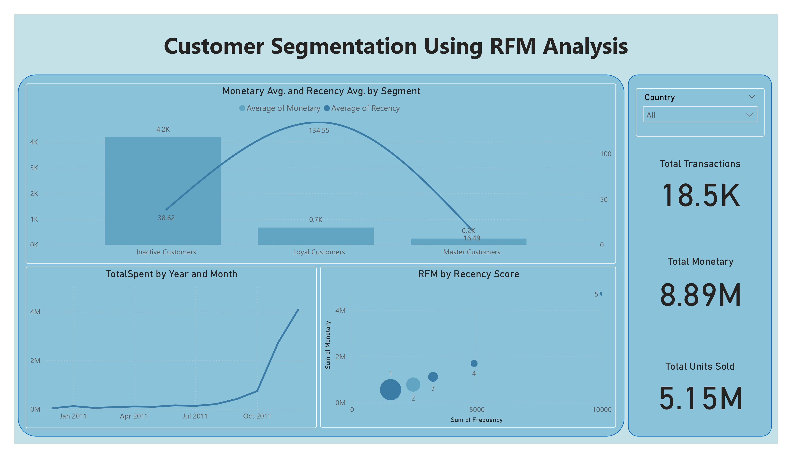

# RFM Customer Segmentation and Dashboard Project

## Overview
This project analyzes the Online Retail Dataset from Kaggle (https://www.kaggle.com/datasets/jihyeseo/online-retail-data-set-from-uci-ml-repo?select=Online) to perform Recency, Frequency, Monetary (RFM) analysis and create an interactive Power BI dashboard. The goal is to segment customers and visualize their behavior for actionable marketing insights.

## Project Steps
1. **Data Cleaning**:
   - Loaded and cleaned the dataset, removing missing `CustomerID` values and converting `InvoiceDate` to datetime.
   - Calculated `TotalSpend` as `Quantity * UnitPrice` and handled zero-value transactions.

2. **RFM Analysis**:
   - Computed Recency, Frequency, and Monetary metrics per `CustomerID`.
   - Assigned `R_Score`, `F_Score`, and `M_Score` using quintiles (1-5).
   - Segmented customers into groups like "Master Customers", "Loyal Customers", "Unstable Customers", and "Inactive Customers".

3. **Visualizations**:
   - Created charts (e.g., bar charts, scatter plots, line charts) using Python libraries (Pandas, Matplotlib, Seaborn).
   - Saved processed data as `rfm_data.csv` and cleaned data as `cleaned_online_retail.xlsx`.

4. **Power BI Dashboard**:
   - Built an interactive dashboard with cards (e.g., Total Customers, Total Revenue), charts (e.g., Average RFM Values by Segment), and slicers (e.g., `Segment`, `InvoiceDate`).
   - Visualized segment distributions and RFM trends for data-driven decisions.

## Requirements
- Python libraries: `pandas`, `matplotlib`, `seaborn` (listed in `requirements.txt`).
- Power BI Desktop for dashboard creation.

## Files
- `rfm_data.csv`: Processed RFM data with segments.
- `cleaned_online_retail.xlsx`: Cleaned transactional data.
- `requirements.txt`: Python package dependencies.

## Dashboard Screenshot

## Usage
1. Install dependencies: `pip install -r requirements.txt`.
2. Load `rfm_data.csv` and `cleaned_online_retail.xlsx` into Power BI.
3. Explore the dashboard and adjust visuals as needed.

